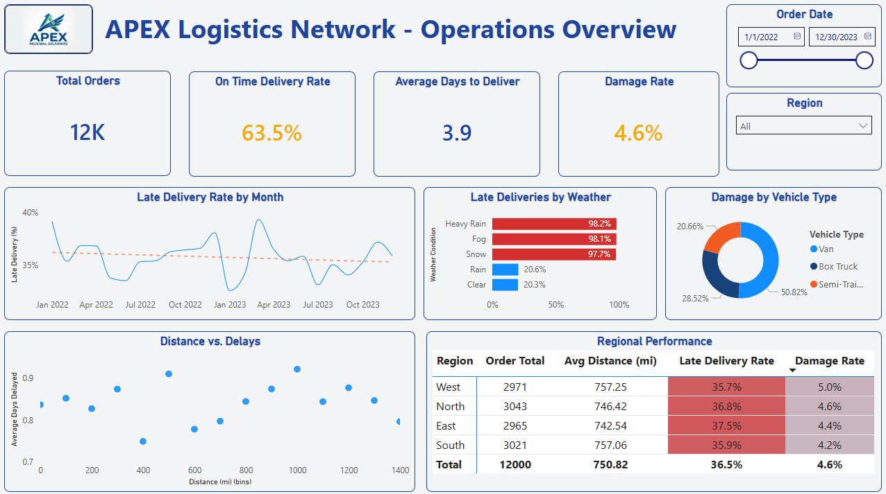

# APEX Logistics: End-to-End Data Pipeline & Analytics


## Table of Contents
- [Executive Summary](#executive-summary)
- [Methodology & Tech Stack](#methodology--tech-stacks)
- [Key Metrics Tracked (KPIs)](#key-metrics-tracked-kpis)
- [Executive Dashboard](#executive-dashboard)
- [Dashboard Features & Key Business Insights](#dashboard-features-&-key-business-insights)
- [Strategic Reccommendations](#strategic-recommendations)
- [Repository Structure](#repository-structure)
- [Future Enhancements](#future-enhancements)

---

## Executive Summary
**APEX Regional Deliveries** is a fictional logistics company facing logistical bottlenecks. Experiencing a recent spike in customer complaints regarding late deliveries and damaged freight. The executive team lacked visibility into the root causes of the operational failures.

This project represents a complete, end to end data engineering and analytics pipeline designed to solve this problem. I generated over 2 years of synesthetic shipping data, loaded it into relational database, engineered a transformation layer to clean anomalies, and built an interactive dashboard to monitor supply chain health.

> ** View the full formal Business Requirements Document (BRD) [here](Business-Requirements-Document.md)**
---

## Methodology & Tech Stacks
This project uses a full Extract, Transform, Load (ETL) and Visualization workflow:
* **Data Generation (Python):** Utilizing `Pandas`, `Faker`, and `Numpy` to generate a realistic synthetic dataset simulating 2 years of daily logistics operations, including randomized variables for weather, travel distance, vehicle type, delivery time and delivery status.
* **Database Management (PostgreSQL / DBeaver):** Designed the databases schema and loaded the raw CSV data into a local PostgreSQL server.
* **Data Exploration (Python / SQL):** Before cleaning data, used methods like `.head()`, `.info()`, and `.isnull.sum()` to view and inspect data. As well as `COUNT()`, `SUM()`, and filters in SQL to find possible flags in the dataset.
    - "Non-Existent" *NULLS* were a key finding in our search through the data. Instead of creating NULL values as advised, the data generation tool instead created empty stings.
* **Data Transformation and Anomaly Handling (SQL):** Created a SQL Views to standardize data types, calculate delivery intervals, and apply conditional logic.
      - I implemented a data quality rule using `CASE WHEN` statement to detect and efficiently correct seasonal anomalies (e.g., transforming impossible "Summer Snowstorms" into "Heavy Rain").
* **Business Intelligence (Power BI):** Connected directly tothe PostgreSQL database to develop an interactive scorecard utilizing sutom DAX measures and exception reporting filters.

---

## Key Metrics Tracked (KPIs)
The following primary KPIs were engineered with DAX to monitor supply chain health:
* **On-Time Delivery Rate (%):** Target > 75%. Measures the efficiency of the routing and delivery network.
* **Damage Rate (%):** Target < 5%. Measures the safety and structural integrity of the freight per vehicle type.
* **Average Days to Deliver:**  Tracks and calculates the average deliver times (by day) regionally or company wide.
* **Total Order:** Tracking order totals orders over periods of time.

---

## Executive Dashboard

---

## Dashboard Features & Key Business Insights
### **Interactive Features:**
* **Range Finder:** Transparent slicers for `Date Range` and `Region` for adjustable ranges.
* **Exception Reporting:** Conditional formatting in the Regional Performance Matrix automatically flags regions failing to meet the 75% delivery time target or exceeding the 5% damage threshold.

### **Key Business Insights:**
1. **Weather Vulnerability:** While distance traveled showed *zero correlation* with delivery delays, "Snow", "Heavy Rain", and "Fog" events cause scheduled delivery rates to plummet, acting as the primary as the primary metric of late packages.
2. **Asset Liability:** **Vans** are disproportionately responsible for fright damage, displaying a damage rate significantly higher than Semi-Trailers and Vans (roughly 50% of all damaged products).
3. **Regional Discrepancies:** While the **East Region** travels the least amount of distance, they struggle to meet key delivery metrics. While the **West Region** succeeds in delivery times, they fall with an increased damage rate.
---

## Strategic Recommendations
Based on the data insights, I recommend the following operational changes for APEX Regional Deliveries:
* **Fleet Audit:** Initiate an immediate audit of all Vans. Investigating whether the 50% damage rate is due to vehicle suspension issues, lack of secure strapping devices, or specific driver handling protocols.
* **Weather Routing Adjustments:** Since distance doesn't impact delay rates at thought, rerouting or planning drivers around localized heavy rain, snow, or fog occurrences even if it adds milage to the delivery route.
* **East Region Delivery Review:** Place the East Region management on a Performance Improvement Plan and pair them with the South Region Directors to share its best logistical practices.
* **West Region Damage Review:** Invest in driver and packaging training to help fight a rising damage rate in product handling.
---

## Repository Structure
```text
|
├──  assets/
|    ├── APEX_logo.png                                        # Company Logo
|    └── logistics_operations_dashboard.png                   # APEX Logistic Network - Operations Overview image
├──  data/
|    ├── apex_logistic_raw.csv                                # Generated raw dataset
|    └── cleaned_logistics_data.csv                           # Generated cleaned dataset
├──  power_bi
|    ├── apex_logsitics_operations_dashboard.Report/          # PBIP Report definition
|    ├── apex_logistics_operations_dashboard.SemanticModel/   # PBIP Data Model
|    ├── apex_logistics_operations_dashboard.pbip             # Power BI Project File
|    └── apex_logistics_operations_dashboard.pbix             # Standard Power BI file
├──  py_scripts
|    ├── 01_data_generator.ipynb                              # Jupyter Notebook data generation
|    ├── 01_data_generation.py                                # Executable Python script
|    ├── 02_explore_apex_data.ipynb                           # Jupyter Notebook data exploration
|    └── 02_explore_apex_data.py                              # Executable Python script
├──  sql_scripts
|    ├── 03_create_raw_tables.sql                             # DDL for Postgres tables
|    ├── 04_exploritory_analysis.sql                          # EDA within raw data
|    └── 05_clean_and_transform.sql                           # DML for Tables and Views
├──  Business-Requirements-Document.md                        # Business Problem and Requirements for analysis
└──  README.md
---
```

## Future Enhancements
While this investigative analysis successfully identified core operational bottlenecks, I plan to improve this project in these meaningful ways:
* **Live Weather Updates:** Integrate a live weather API with Python to replace synthetic weather generation.
* **Predictive Forecast:** Implement a predictive Machine Learning model with Python to forecast the probability being delayed based on Route and Vehicle Type.
* **Driver Type Drilldown:** Further analyze driver type (class), and tenure to observe correlation to delayed deliveries and damaged packages.
* **Vehicle Equipment Exploration:** Inspect vehicle equipment (e.g., tires, windshield wipers, securing devices) to determine the optimal equipment for inclement weather and damaged products.  
